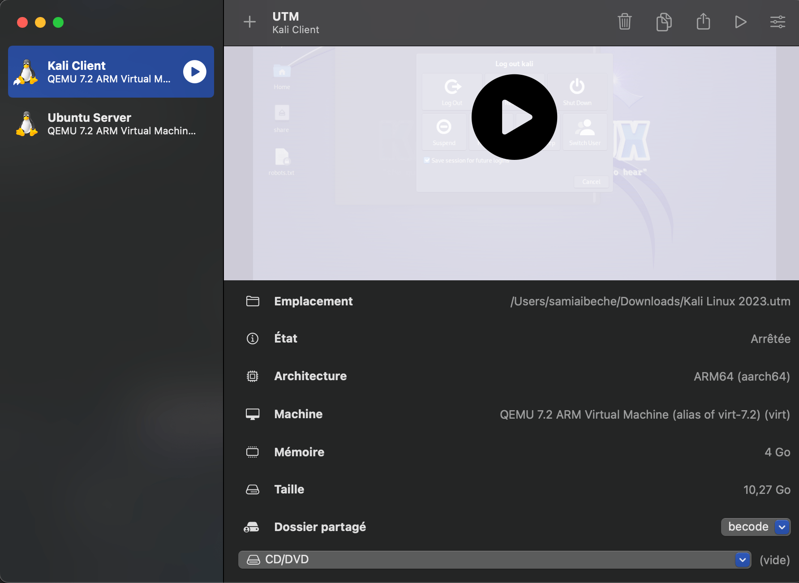
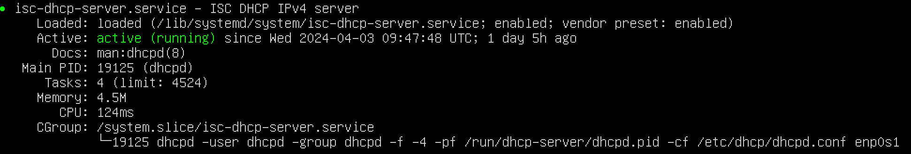
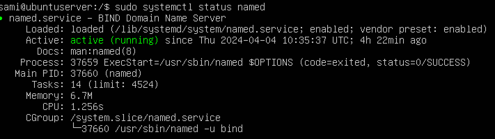
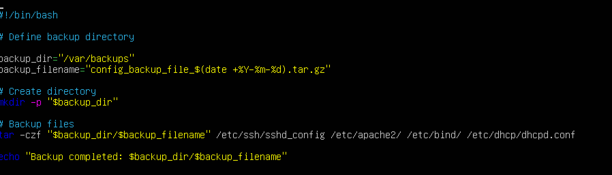

# Server Configuration Documentation

## Overview

This document provides a comprehensive guide on setting up a Linux server without a graphical user interface (GUI) to run multiple services including DHCP, DNS, a web server with MariaDB for database management, and GLPI for internal resource management. It also covers the setup for remote server management via SSH and includes additional software installations.

## Table of Contents

- [DHCP Server Configuration](#dhcp-server-configuration)
- [DNS Server Configuration](#dns-server-configuration)
- [Web Server and MariaDB Setup](#web-server-and-mariadb-setup)
- [Remote Management via SSH](#remote-management-via-ssh)
- [Additional Software](#additional-software)
- [Weekly Backup Configuration](#weekly-backup-configuration)
- [Conclusion](#conclusion)

## Environment setup


For the project, we've set up two virtual machines (VMs) to create a controlled and isolated environment:

__Client VM__ running Kali Linux: Chosen for its comprehensive suite of security and penetration testing tools, allowing us to assess and ensure the security of our server setup.

__Server VM__ running Ubuntu: Hosts our core services including DHCP, DNS, Apache with MariaDB, and GLPI, providing a stable and widely-used platform for server-side configurations.



## DHCP Server Configuration

### Installation

```bash
sudo apt-get update
sudo apt-get install isc-dhcp-server
```

### Configuration

* File Location: `````/etc/dhcp/dhcpd.conf`````
* Scope Definition: Define a subnet with a range of IP addresses to be dynamically allocated to clients.

```bazaar
subnet 192.168.64.0 netmask 255.255.255.0 {
  range 192.168.64.10 192.168.64.100;
  option domain-name-servers 192.168.64.5;
  option routers 192.168.64.1;
}
```

__Service Management:__ Start and enable the DHCP service.

```bazaar
sudo systemctl start isc-dhcp-server
sudo systemctl enable isc-dhcp-server
```





## DNS Server Configuration

### Installation

```bazaar
sudo apt-get install bind9
```

### Configuration

* File Location: `````/etc/bind/named.conf`````
* Zone Files: Located in ```/etc/bind/zones/```(if you organize your zones in a separate directory).
* Scope Definition: Define a subnet with a range of IP addresses to be dynamically allocated to clients.

Example zone definition :

```bazaar
zone "local.becode" IN {
    type master;
    file "/etc/bind/zones/db.local.becode";
};
```


### Start and enable BIND.

```bazaar
sudo systemctl start bind9
sudo systemctl enable bind9
```



## Web Server and MariaDB Setup

### Apache Installation

```bazaar
sudo apt-get install apache2
```


### MariaDB Installation

```bazaar
sudo apt-get install mariadb-server
```


## GLPI Setup

* Download GLPI and extract it to the web server's root directory.
* Create a MariaDB database for GLPI.
* Access http://192.168.64.6/glpi to run the web installer.


## Remote Management via SSH
* Ensure SSH is installed (openssh-server package).
* Edit /etc/ssh/sshd_config for any specific configurations.
* Restart SSH service to apply changes.


## Additional Software

* LibreOffice: For office productivity tools.
* GIMP: For image editing.
* Mullvad VPN: For secure internet access. Note: Install the VPN client as per the official documentation.

## Weekly Backup Configuration

Set up a cron job to back up configuration files weekly.

* Edit the crontab with sudo crontab -e.


* Add a line for the backup script, e.g., 0 3 * * 0 /path/to/backup_script.sh, to run it weekly.




### You can check below if each of the services (DHCP, DNS, Apache, MariaDB, and SSH) is running properly on a Linux system.
 
```
sudo systemctl status isc-dhcp-server
sudo systemctl status bind9
sudo systemctl status apache2
sudo systemctl status httpd
sudo systemctl status mariadb
sudo systemctl status mysql
sudo systemctl status ssh
```
Conclusion
This server setup provides a solid foundation for managing network services and hosting internal resources. Regular backups ensure configuration persistence and disaster recovery capability
